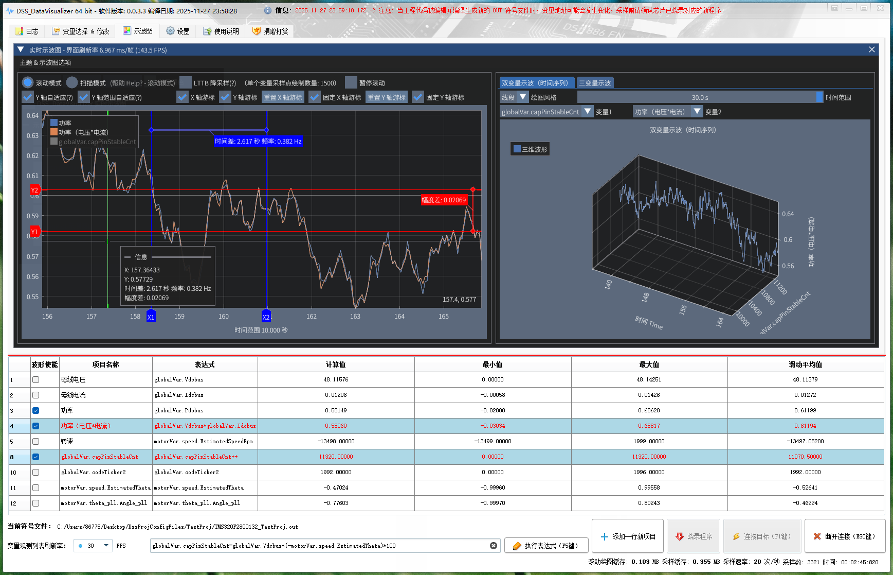
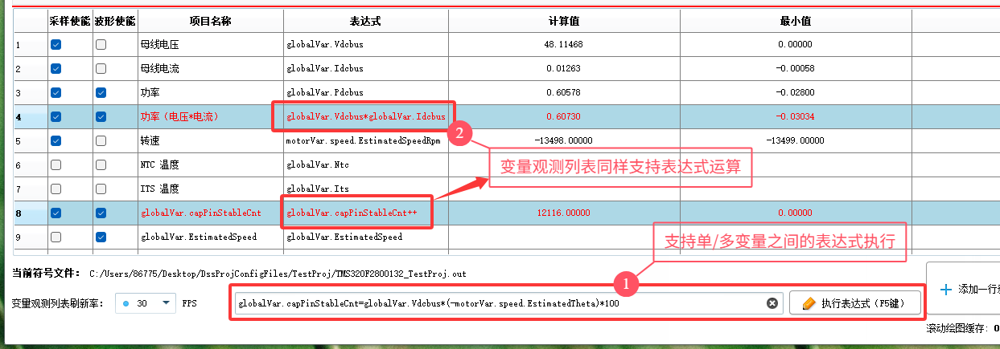
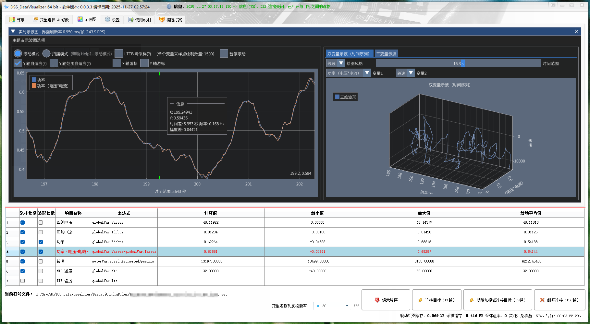
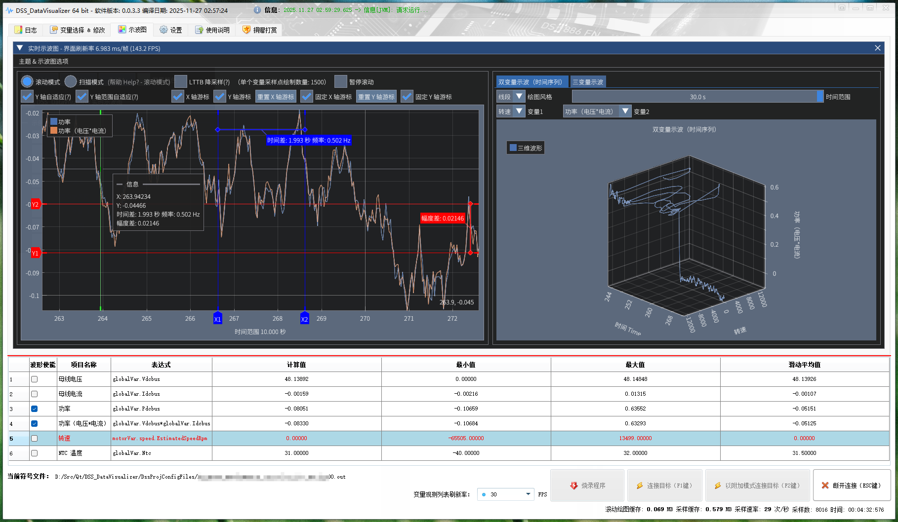
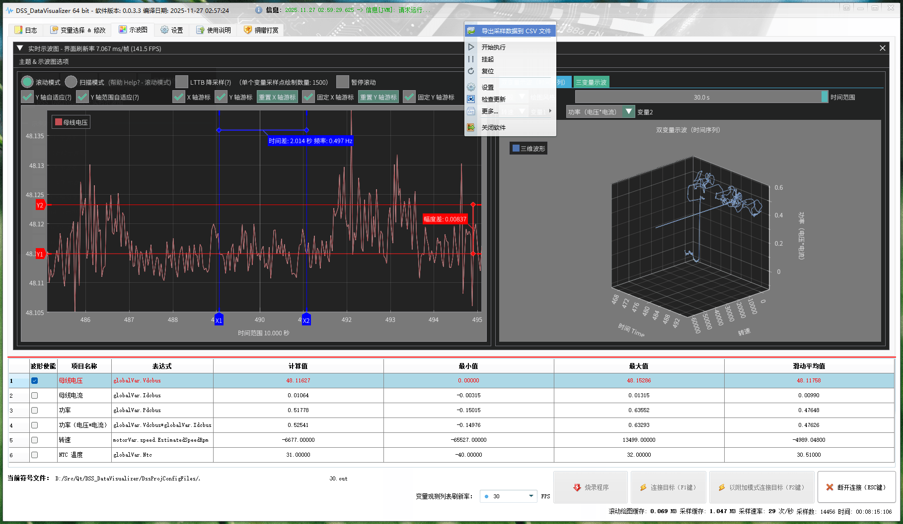
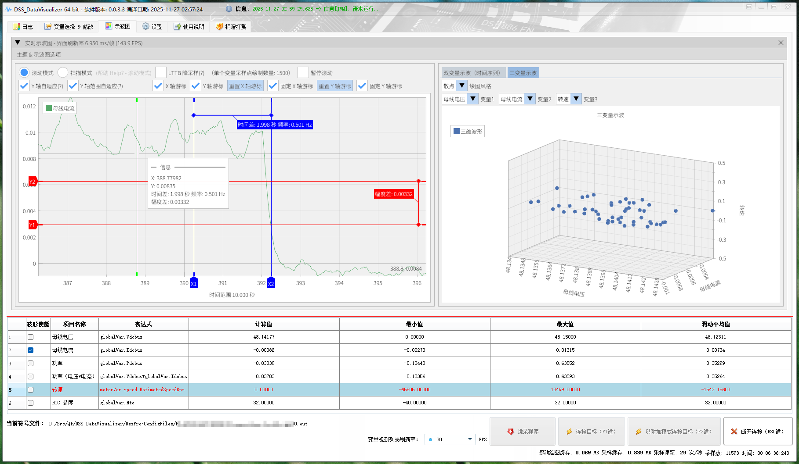
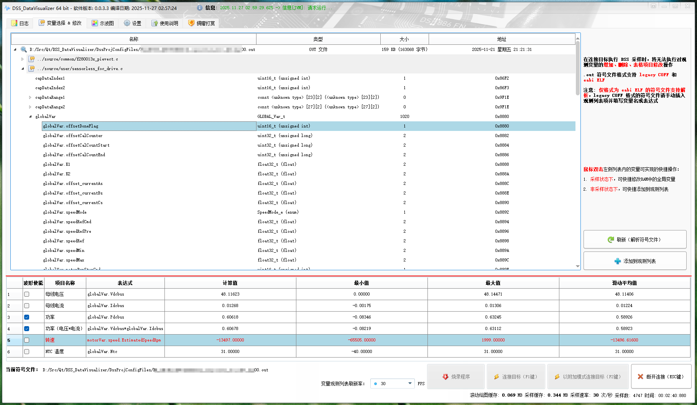
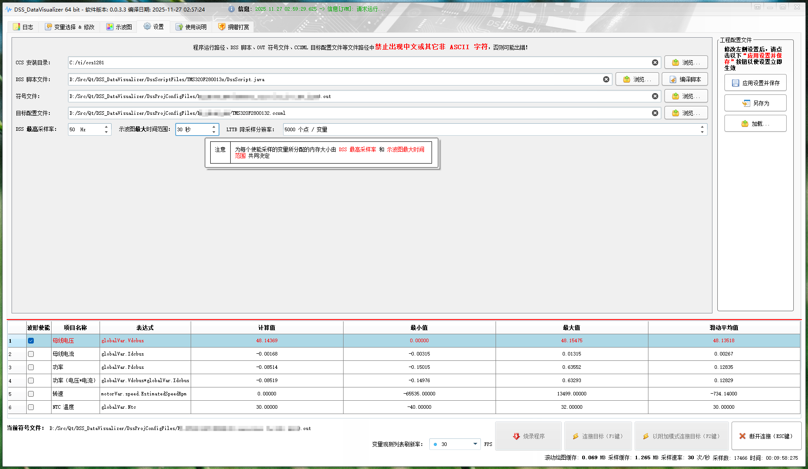
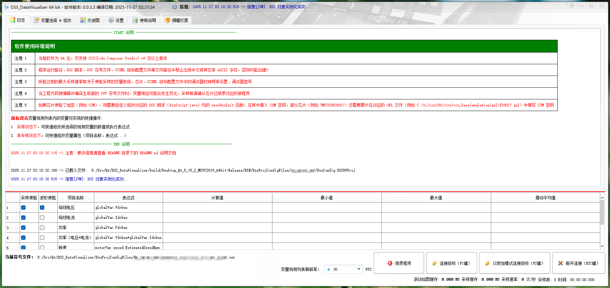
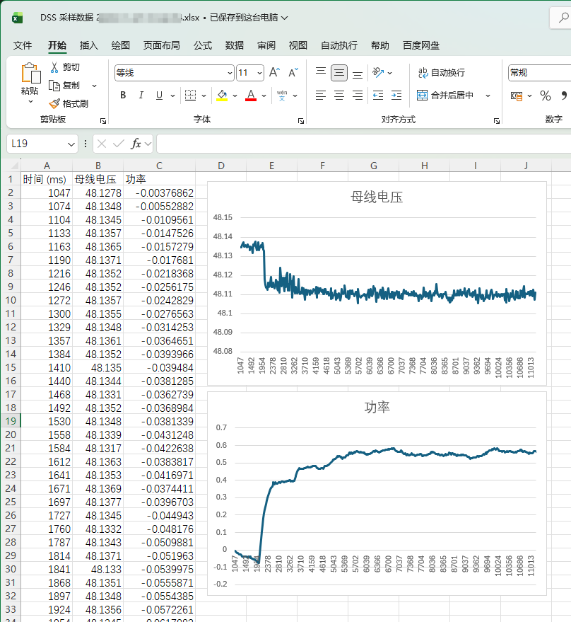

<table style = "width: 100%;">
<tr>
<td colspan="2">

:beers: DSS_DataVisualizer - 适用于 Texas Instruments 德州仪器芯片的非侵入式数据可视化实时示波工具 

> [!NOTE]
> 本仓库用于 DSS_DataVisualizer 的发布，下载请跳转 [发布页面 (当前版本: v0.0.3.3)](https://github.com/DigitalAllianceStudio/DSS_DataVisualizer/releases/latest)

> [!IMPORTANT]
> 1. 理论上 CCS 支持的芯片（例如 `TMS320F28035` 以及国产1:1替代芯片例如湖南进芯的DSP，例如 `ADP32F035`，以及 `MSP430` 等...）和调试器（例如 `XDS100v3`、`XDS110`、`XDS560v2 Plus`），本软件也都能支持（请自行尝试）
> 2. :warning: 首次使用需要配置系统环境变量，否则运行会提示“*由于找不到 jvm.dll，无法继续执行代码。重新安装程序可能会解决此问题。*”，请查看发布包中的 `README.md` 说明文档进行配置。
> 3. :warning: 若运行报错（如`缺少动态链接库`），请安装 :package: `vcredist_x64.exe` 和 :package: `vc_redist.x64.exe` 运行库。

</td>
</tr>
<tr>
<td style>

> [!NOTE]
> Qt 通过 JNI 去跟 DSS 的 Java 接口交互，以访问仿真器的 DebugServer，通过物理接口 JTAG 对芯片进行非侵入式的读写访问，并实时可视化示波显示到用户界面。

## :receipt: 参考资料

- [Java Scripting with DSS](https://software-dl.ti.com/ccs/esd/documents/dss_java_dss_scripting.html)
- [调试服务器脚本(DSS)入门教程](https://software-dl.ti.com/ccs/esd/training/workshop/ccsv9/dss_fundamentals-workshop-chinese.html)
- DSS API `C:/ti/ccs1281/ccs/ccs_base/scripting/docs/DS_API/index.html`

## :package: DSS 脚本文件参考示例

[TMS320F2802x/DssScript.java](DssScriptFiles/TMS320F2802x/DssScript.java)
[TMS320F280013x/DssScript.java](DssScriptFiles/TMS320F280013x/DssScript.java)

</td>
<td style>

## :receipt: 其它说明

> [!TIP]
> 功能介绍：

1. 采样项目名称自定义（方便观察）
2. 支持自定义 GEL 表达式
3. 支持 GEL 表达式读值，例如 `gVdcbus*gIdcbus`、`-gVar*8.123f+50` 等...
4. 支持 GEL 表达式写值，例如 `gEnable=1`、`gWriteVar=-5.678f` 等...
    
5. 变量增删改查、采样使能、波形使能
6. 高清示波图（模式有`扫描模式`、`滚动模式`：支持滚动、缩放、平移、游标测量等操作）
7. 支持`采样数据导出 CSV`
8. 支持烧录程序
9. 支持 `运行`、`挂起`、`复位` 操作

</td>
</tr>
</table>

### 软件截图

### 采样数据导出 CSV

----------

:star: Copyright © 2023 - 2025 Digital Alliance Studio. All rights reserved.
